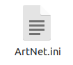

### Readme

#### [Prismatik Art-Net plugin](#github)

* * * * *

#### Table of contents

-   [Dependencies](#dependencies)
-   [Configuration](#configuration)
-   [Start the plugin](#start_the_plugin)
-   [Troubleshooting](#troubleshooting)
-   [Useful URLs](#useful_urls)

* * * * *

#### Dependencies

-   [StupidArtnet](https://github.com/verycollective/stupidArtnet)
-   [Python 3.6](https://www.python.org/downloads/)
-   [Prismatik](https://github.com/psieg/Lightpack/releases) (Tested on 5.11.2.22)
-   [lightpack.py](https://github.com/Atarity/Lightpack/blob/master/Software/apiexamples/pyLightpack/lightpack.py) (extended by Lasse Götte)

* * * * *

#### Installation

Install Python (I tested it on Python 3.6.9, but it should work on the current version)

In Prismatik:

-   Setup your Device (you can use this plugin with every Prismatik compatible device. If your only Device is the Art-Net Node, choose *Virtual LED device*)
-   Check *Expert mode* under the *Profiles* menu
-   Check *Enable server* under the *Experimental* menu

Download and extract the repository

Place ArtNet folder from the extracted repo in the Prismatik plugin directory:

-   Windows: *C:\\Users\\username\\Prismatik\\Plugins\\*
-   Linux: */home/username/.Prismatik/Plugins/*

Adjust settings in the ArtNet.ini file (instructions in the next chapter)

* * * * *

#### Configuration

Edit **ArtNet.ini** in the ArtNet plugin folder with your preferred text editor

-   **[Main]**
    -   Uncomment the *Execute* line depending on your operating system by removing the *\#* at the beginning
-   **[Lightpack]**
    -   Generate a Api-key in the *Experimental* menu in Prismatik and copy it
    -   Paste the Api-key in the *key* line in the ini file
-   **[Artnet]**
    -   Enter the IP of your Art-Net node in the *host* line
    -   Enter the DMX-universe you want to use in the *universe* line
-   **[Fixtures]**
    -   Start with a title like **[Fixture\_xxx]** (xxx is the name, you can customize. I recommend 001,002,...)
    -   Enter the DMX channel range in the *range* line (the range consists two numbers, separated by a ",". The first number is the start channel and the second number is the channel count)
    -   Enter the DMX channel types in the *mapping* line (the types are R=red, G=green, B=blue, D=dimmer, -=not in use)
    -   The channel types are entered in channel order. Each fixture has to have just one of the types (R,G,B,D). Other channel types are not needed and marked by -
    -   Below is an example for an 4 channel RGBAW+Dimmer fixture on channel 1
    -   The order of the fixtures in the ini file is mapped to the order of the LEDs in Prismatik

* * * * *

#### Start the plugin

-   Click the *refresh* button in the *Plugins* menu in Prismatik
-   Check the *Art-Net* plugin in the *Plugins* menu in Prismatik

* * * * *

#### Troubleshooting

-   Click on the *Art-Net* plugin in the *Plugins* menu
-   Click on *Log* in the *Info* field
-   If the log is empty, make sure you set the right path to the Python executable in the ini file
-   **ERROR-01**
    -   One or both values in the fixtures range in the ini file are 0
    -   The first valid channel and the minimum channel count is 1
-   **ERROR-02**
    -   The channel range is out of range (1-512)
    -   Make sure, the start channel is not defined below 1 or above 512
    -   Make sure, the range is not reaching out of 512 (starting at the start channel)
-   **ERROR-03**
    -   Only the characters *R,G,B,D,-* are allowed in the fixture mapping
-   **ERROR-04**
    -   Each character of *R,G,B,D,-* is unique in the fixture mapping
    -   If your DMX device has multiple RGB channels (for example a LED-bar), define multiple fixtures for it
-   **ERROR-05**
    -   Each character of *R,G,B,D,-* has to be exactly once in each fixture's mapping
    -   If your DMX device has no dimmer, define it as a 4 channel device with the 4th channel as D (dimmer)
-   **ERROR-06**
    -   The amount of *R,G,B,D,-* characters in the fixture mapping has to match the channel count, defined in the fixture range
-   **ERROR-07**
    -   You have to define as many fixtures as LEDs, defined in Prismatik

* * * * *

#### Useful URLs

-   [Build a simple diy Art-Net node](https://robertoostenveld.nl/art-net-to-dmx512-with-esp8266/)

